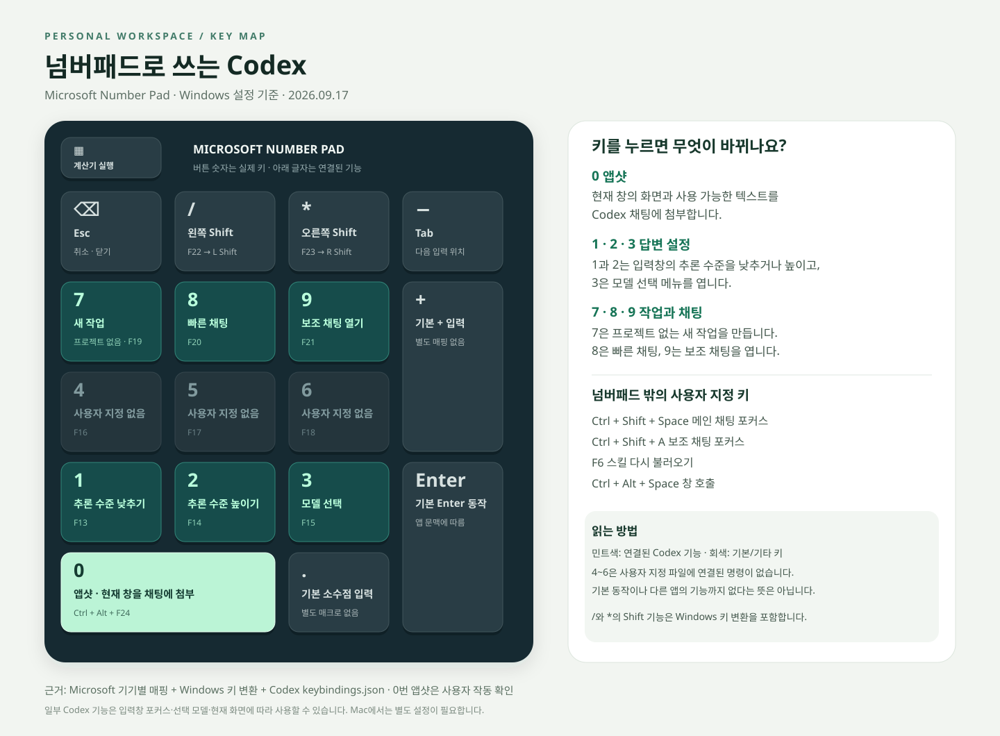

# Microsoft Number Pad 설정

Microsoft Number Pad의 키 배치와 다른 PC로 이전하기 위한 설정 도구입니다.

**Windows 적용 파일은 `windows/`에, 현재 Mac의 설정 스냅샷은 `macos/`에 있습니다.**

사용자가 지정한 Codex 단축키는 `codex/`에 별도로 포함했습니다. 대화 기록·인증 정보·전체 앱 설정은 포함하지 않습니다.

## Windows에서 사용

1. 이 저장소를 **Code → Download ZIP**으로 내려받고 압축을 풉니다.
2. Number Pad를 연결하고 Microsoft 마우스·키보드 센터를 설치합니다.
3. Codex와 Microsoft 마우스·키보드 센터 창을 완전히 종료합니다.
4. `windows/1-Apply.cmd`를 일반 사용자로 실행합니다. 기존 설정을 먼저 백업합니다.
5. Codex 사용자 지정 기능까지 옮기려면 `codex/Apply.cmd`를 실행합니다. 같은 명령은 이 프로필로 바꾸고, 다른 기존 명령은 유지합니다. `null`로 저장한 단축키 해제도 그대로 적용됩니다.
6. `/`, `*`를 좌우 Shift로 사용하려면 `windows/2-Windows-Shift.cmd`를 실행해 관리자 권한을 승인합니다.
7. PC를 재부팅한 뒤 `windows/Check.cmd`와 실제 키 입력으로 확인합니다.

자세한 적용 범위·복구 방법은 [Windows 사용 안내](windows/사용안내.md)를 확인하세요.

| Number Pad 키 | 기능 |
|---|---|
| 0 | Ctrl + Alt + F24 → Codex 앱샷 |
| / | F22 → Windows 변환 적용 후 왼쪽 Shift |
| * | F23 → Windows 변환 적용 후 오른쪽 Shift |
| - | Tab |
| Backspace | Esc |
| 1 / 2 / 3 | 추론 수준 낮추기 / 높이기 / 모델 선택 |
| 4 / 5 / 6 | F16 / F17 / F18 — 사용자 지정 기능 없음 |
| 7 / 8 / 9 | 프로젝트 없는 새 작업 / 빠른 채팅 / 보조 채팅 열기 |
| . | 기본 소수점 입력 |
| 계산기 | 계산기 실행 |

위 Codex 기능에는 `codex/Apply.cmd` 적용이 필요합니다. 4~6은 사용자 지정 파일에 연결된 명령이 없다는 뜻이며, 다른 앱이나 기본 동작까지 없다고 단정하지 않습니다. Windows의 F22/F23 변환은 해당 PC 전체에 적용됩니다.

추가 Codex 단축키: `Ctrl+Shift+Space` 메인 채팅 포커스, `Ctrl+Shift+A` 보조 채팅 포커스, `F6` 스킬 다시 불러오기, `Ctrl+Alt+Space` 창 호출. `archiveThread`, `composer.cycleReasoningEffort`, `keyboardShortcuts`는 사용자 지정 파일에서 단축키가 해제되어 있습니다.

Codex 추가 설정은 `codex/Restore.cmd`로 복구합니다. 전체 적용을 되돌릴 때는 **codex/Restore.cmd → windows/Restore.cmd → windows/Restore-Windows-Shift.cmd** 순서입니다. 해당 PC에서 이후 수정한 단축키가 있으면 자동 복구를 중단합니다.

## Mac에서 사용

Windows의 `.cmd`, `.ps1`, `.reg` 파일을 Mac에서 실행하지 마세요. [Karabiner-Elements](https://karabiner-elements.pqrs.org/)에서 Microsoft Number Pad만 대상으로 설정하고 EventViewer로 실제 입력을 먼저 확인해야 합니다.

현재 Mac 설정과 적용 시 주의 사항은 [Mac 사용 안내](macos/README.md)를 확인하세요. Windows 배치도와 위 표는 Windows용이며, Mac에서는 4번이 Codex 음성 대화, 5번이 Codex 채팅창 음성 입력, 6번이 macOS 받아쓰기입니다. `0`의 앱샷과 실제 음성 입력 동작은 아직 검증하지 않았습니다.

## 검증 범위

- 원래 Windows PC에서 0번의 실제 앱샷 실행을 사용자가 확인했습니다.
- 내보낸 16개 키 설정과 매크로 2개가 원본과 일치함을 확인했습니다.
- Windows 기본 PowerShell의 읽기 전용 확인과 설정 편집 보호 로직을 검사했습니다.
- 다른 PC의 실제 입력과 앱샷 첨부는 대상 PC에서 별도로 확인해야 합니다.

인증 정보, 블루투스 페어링 정보, 전체 Codex 설정은 포함하지 않습니다. 복구 백업은 적용할 PC의 LocalAppData/ProgramData에 별도로 저장됩니다.
